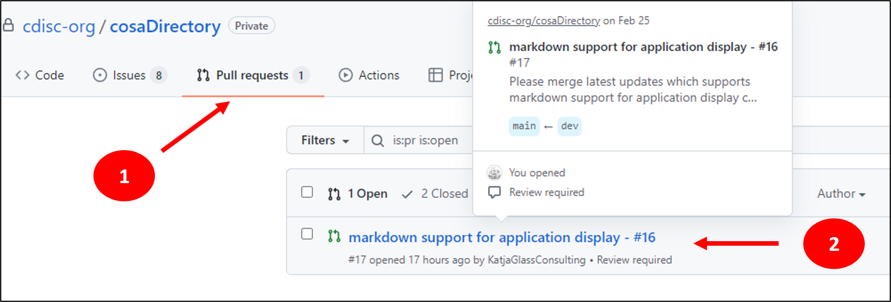
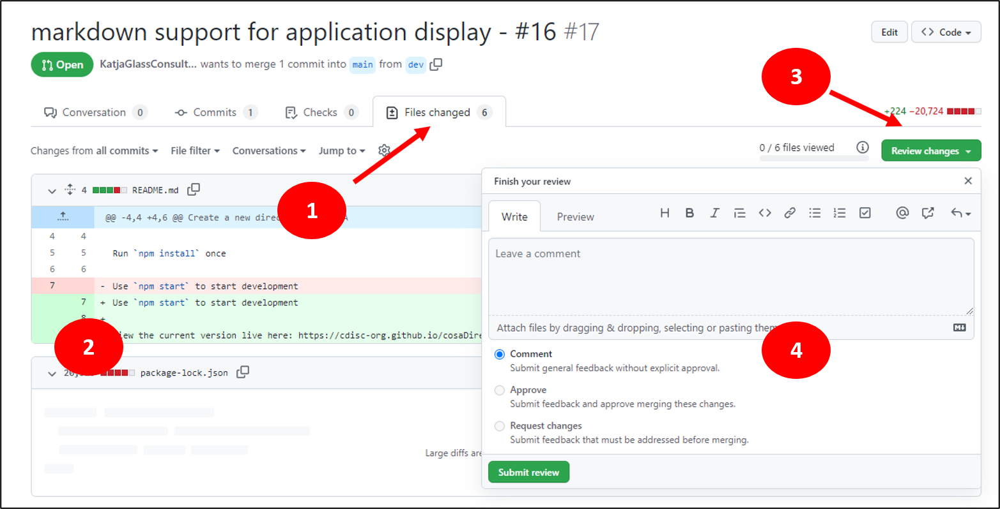
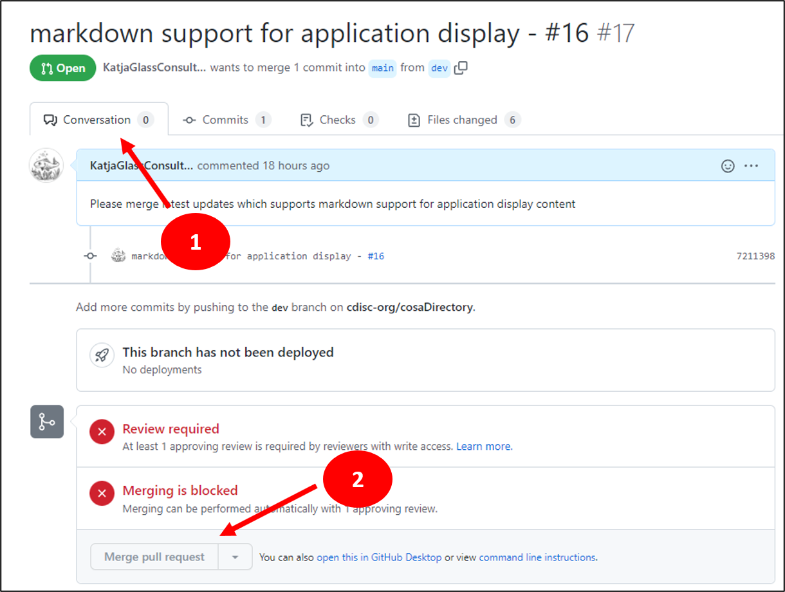

# How to instructions to for GitHub tasks

## Review and Approve PR (pull request)

Navigate to the pull request. Go to the "Pull request" tab and select the corresponding pull request you want to approve:

Then you see details on the Pull Request. The next step is to review and approve. Go to the "Files changed" tab (1), perform a review of all changes (2). Then click the "Review changes" action (3) and fill out the form, e.g. provide a comment, select "Approve" if applicable and finally "Submit review".

## Merge PR (pull request)

When a PR is reviewed (not the submitter of the pull request), the next step is to merge the branch. Go back to the "Conversation" tab and click the "Merge pull request" button.

