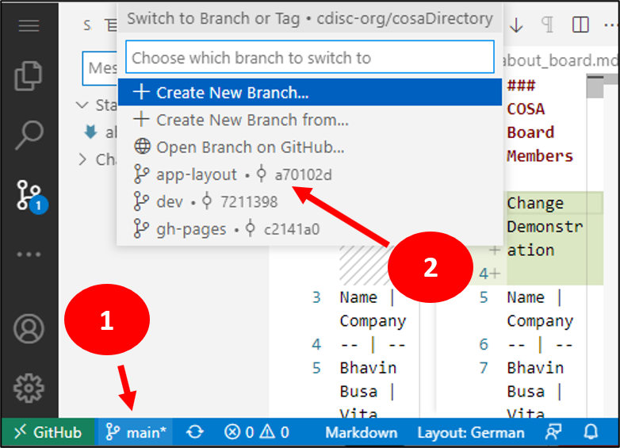
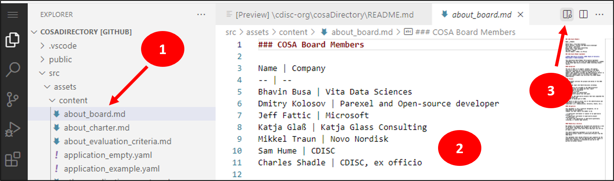
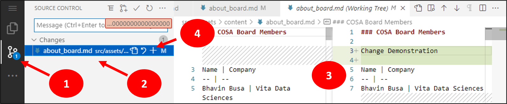
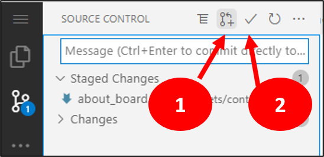

# How to work with GitHub

## Local Environment

Use Visual Studio Code or other tools supporting GitHub pull/pushs. Pull the latest "dev" branch and create a new branch, e.g. "dev_doc_updates". Modify the files you need. Install NPM if not already available. In the command line use `npm install` to install all JavaScript packages needed and `npm start` to start the application. While this is running, you can change files and immediately see the updates in the browswer. Typically the browser window open per default. You can also go to http://localhost:3000/ in your browser (when http://localhost:3000/cosaDirectory starts, to to http://localhost:3000/ to have it correctly working).

Use `CNTR + C` in the console to stop the npm.

## In-GitHub Environment

Press "." in your keyboard to open an in-browser environment. 

You can select which branch you want to work in. Per default you are working in the "main" branch where finally a pull-request should be performed. If you are developer of the repository, you might want to directly work on a specific branch - for example the "dev"-branch. You can select it by clicking at the bottom the "main" branch (1) and then select a different branch (2).

Then select the file you want to edit (1), edit the text in the main window (2) and preview if it is a markdown file (3).

Remark: You see a preview of the markdown which is finally rendered into the complete app. You do not see the app up and running

After all your edits, go to the "Source Control" tab (1). You can check all files you changed by clicking them (2) and review the changes in the working tree (3). If you are fine with your changes, "stash" these files (4) via the plus sign.

Finally create a pull request (1) or directly commit (2) the changes when you are in a dev branch.

